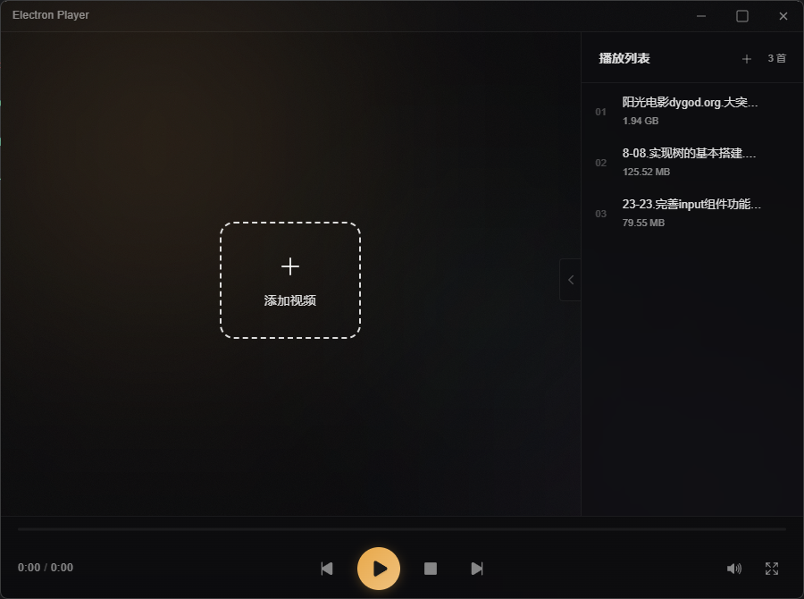
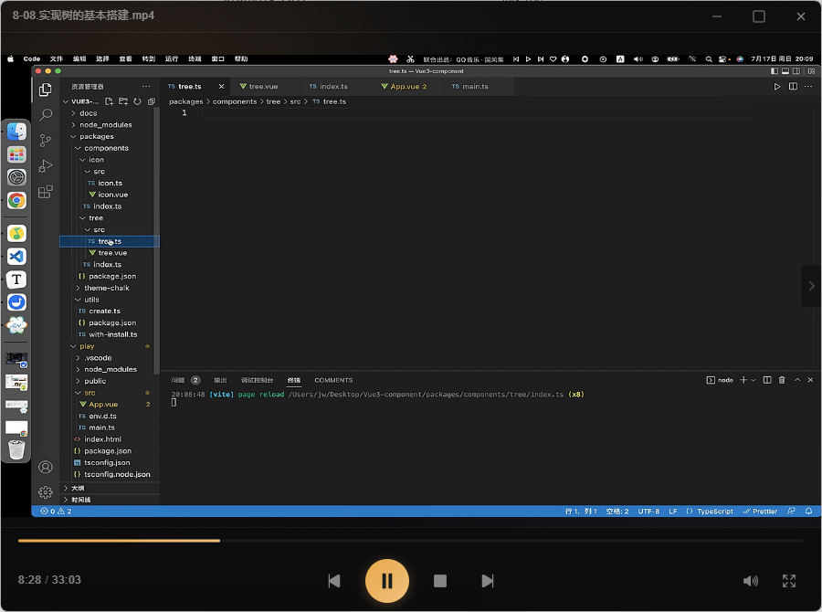

# electron-player

## 概述

**该项目目的是为了学习如何使用第三方的`C++`库，仅供参考学习**

底层使用`libvlc.dll`库实现视频播放功能，`libvlc.dll`的版本是`3.0.8`

核心是使用`koffi`库调用`libvlc.dll`库的函数

核心文件放在`src\renderer\src\player\index.ts`

## 效果展示





## 启动项目

### 安装依赖

```bash
$ npm install
```

### 开发

```bash
$ npm run dev
```

### 构建

```bash
# For windows
$ npm run build:win

# For macOS
$ npm run build:mac

# For Linux
$ npm run build:linux
```

### 生成应用图标

1、将新 `SVG` 图标放到 `build/icon.svg`

2、运行如下命令

```bash
$ npm run generate:icon
```

脚本会自动生成：

- build/icon.png (512×512)
- build/icon.ico (Windows 多尺寸图标)
- resources/icon.png (512×512)
